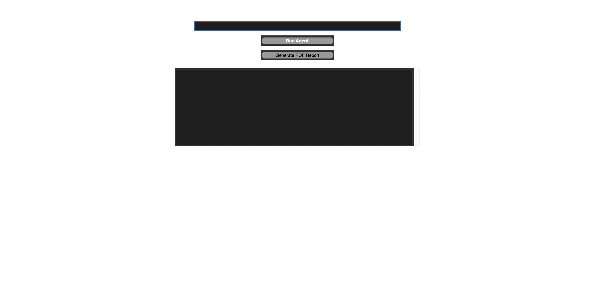

# 🚀 Meta AI Agent GUI




> A powerful desktop AI agent built with **Python and Tkinter** that performs sentiment analysis, generates data visualizations, and exports automated PDF reports — all inside a clean graphical interface.

---

## 📌 Overview

**Meta AI Agent GUI** demonstrates how intelligent software agents analyze user goals, process textual data, and present insights visually.

This project combines **Artificial Intelligence concepts with desktop GUI development**, making it an excellent portfolio project for roles in:

✅ AI Engineering  
✅ Data Science  
✅ Python Development  

Built with a focus on **performance, simplicity, and real-world usability.**

---

## ✨ Features

### 🧠 AI Sentiment Analysis
- Uses **TextBlob NLP** to analyze sentiment polarity.
- Classifies text as **Positive, Negative, or Neutral.**

### 📊 Real-Time Data Visualization
- Automatically generates histograms showing data distribution.
- Implemented using **Matplotlib embedded inside Tkinter.**

### 📄 Automated PDF Reports
- Creates professional downloadable reports with analyzed results.
- Powered by **ReportLab.**

### ⚡ Fast & Lightweight
- Simulated model loading for quick startup.
- No heavy downloads required.

### 🖥️ Modern Desktop GUI
- Built completely with **Tkinter**
- Smooth and responsive interface
- Scrollable output console for better readability

---

## 🛠️ Tech Stack

### Language
- Python 3.8+

### Libraries Used
- **Tkinter** — GUI development  
- **TextBlob** — NLP sentiment analysis  
- **NumPy** — Data generation  
- **Matplotlib** — Visualization  
- **ReportLab** — PDF creation  
- **Threading** — Non-blocking UI  

---

## 📂 Project Structure

```
meta-ai-agent/
│
├── app.py                # Main application
├── requirements.txt     # Dependencies
├── README.md            # Documentation
├── LICENSE
├── .gitignore
│
├── agent_architecture/  # Agent design logic
├── code_generator/      # Code generation module
├── deployment/         # Deployment configs
└── goal_analysis/      # Goal processing logic
```

---

## ⚙️ Installation & Setup

### 1️⃣ Clone the Repository

```bash
git clone https://github.com/AakashSingh07/meta-ai-agent.git
cd meta-ai-agent
```

### 2️⃣ Create Virtual Environment (Recommended)

**Mac/Linux**
```bash
python -m venv venv
source venv/bin/activate
```

**Windows**
```bash
python -m venv venv
venv\Scripts\activate
```

### 3️⃣ Install Dependencies

```bash
pip install -r requirements.txt
```

---

## ▶️ Run the Application

```bash
python app.py
```

✅ The GUI launches instantly.

---

## 📈 How It Works

1️⃣ Enter your AI agent goal  
2️⃣ Click **Run Agent**  
3️⃣ Sentiment analysis is executed  
4️⃣ A histogram visualization is generated  
5️⃣ Export results using **Generate PDF Report**

---

## 🎯 Use Cases

✔ AI Portfolio Project  
✔ Python GUI Demonstration  
✔ NLP Beginner Project  
✔ College Major Project  
✔ Resume Booster  

---

## 🔥 Future Improvements

- Integrate transformer-based models  
- Add voice-enabled AI agents  
- Connect with OpenAI / LLM APIs  
- Embed charts inside exported PDFs  
- Package as a standalone desktop application  

---

## 👨‍💻 Author

**Aakash Singh**

If you found this project helpful, consider giving it a ⭐ on GitHub!

---

## 📜 License

This project is licensed under the **MIT License** — feel free to use and modify it.
